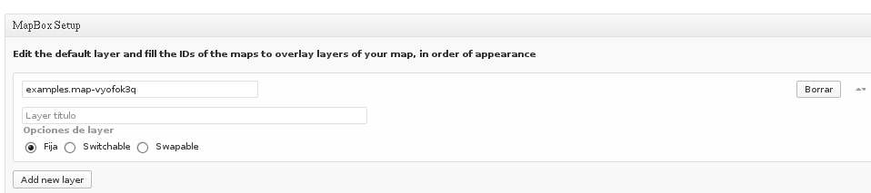
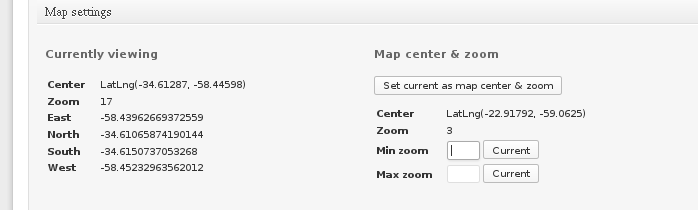
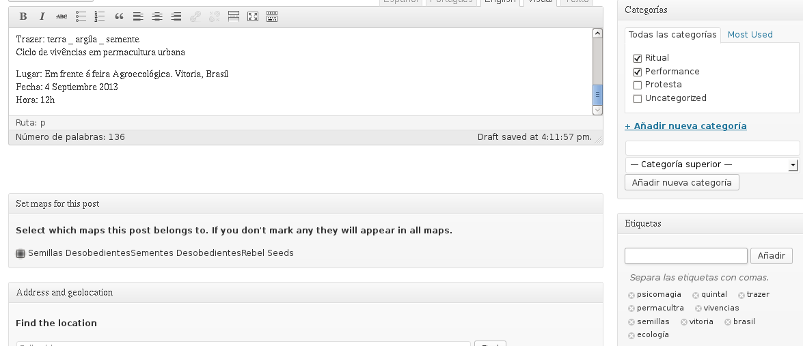
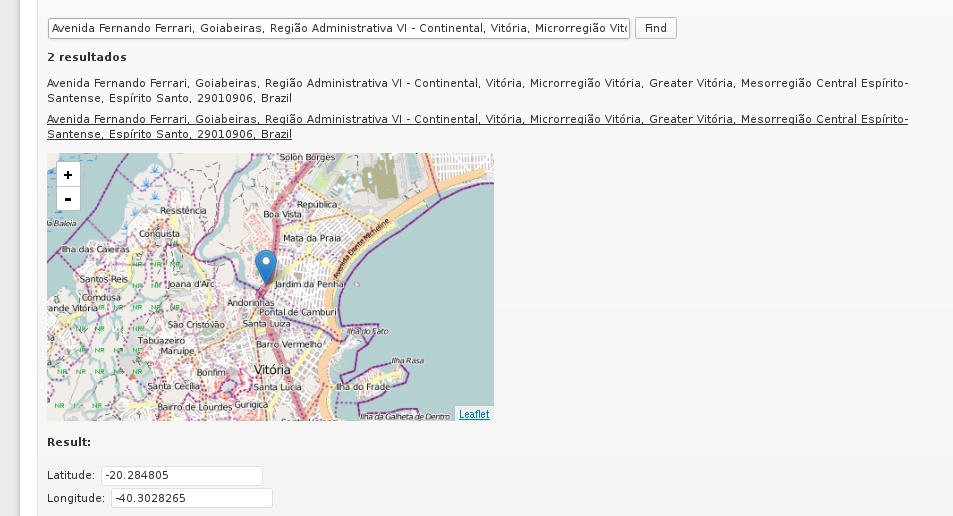
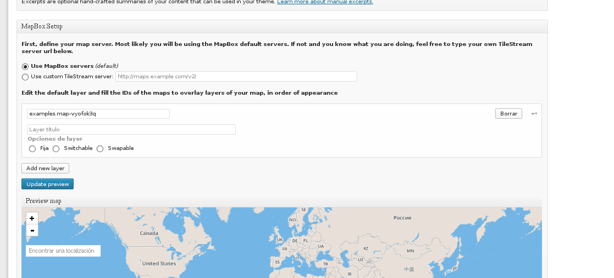

CÔMO INSTALAR JEO WORDPRESS
=============================

##Y qué es JEO Wordpress

El tema JEO WordPress funciona como plataforma de geoperiodismo que permite a organizaciones de noticias, bloggers, ONGs, grupos de activistas a publicar noticias como capas de información en mapas digitales. Con JEO, crear la interacción entre capas de información e información contextual es mucho más intuitivo e interactivo. El tema está preparado para contenido multilengual y facilita las tareas de publicación.

Puedes postear historias geoetiquetadas y crear páginas de diseño enriquecido para cada una de las historias. A la vez, simplemente atribuyendo los ids de las capas hosteadas en Mapbox, puedes manejar mapas sofisticadas sin sacrificar el rendimiento, agregar leyendas directamente con html y fijar los parámetros del mapa. Todo directo desde el panel de administración de Wordpress. 

Features

    Leaflet map library
    MapBox maps integration with filtering layers tools.
    Geocoding WordPress posts using OpenStreetMaps or Google Maps supporting custom post types.
    Google Street View support for Google Maps geocoding.
    Customizable marker icons that can be associated to categories, custom taxonomies or posts directly.
    Map markers query integrated to posts query.
    GeoJSON API (any content /?geojson gives the geojson output). E.g.: yourwebsite.com/category/one/?geojson
    Extensive hooks with documentation yet to come
    Support qTranslate multilanguage plugin

Features to come

    Custom map tiles, such as stamen maps, MapQuest and OpenStreetMap
    CartoDB integration

<http://cardume.github.io/jeo/>
y el repositorio está en: <https://github.com/cardume/JEO>

## Wordpress auto-hospedado

<http://codex.wordpress.org/WordPress_Quick_Start_Guide#Install_WordPress_on_Your_Web_Host>

Antes de nada, para usar el tema JEO WordPress, debes tener una versión auto-hosteada de Wordpress.

Tener un blog WordPress autohosteado tiene muchas ventajas: tenés control sobre tu código y así podés implementar cualquier tema, modificarla totalmente o crear la tuya propia. Puedes agregar el plugin que quieras y hackear el código. 

Acá están las instrucciones para montar tu WordPress auto-hosteado.
<http://codex.wordpress.org/WordPress_Quick_Start_Guide>

Necesitas un host web que tenga PHP o MySQL. Para faciltar la instalación de Wordpress, asegúrate que tu web host tenga panel de control o algo parecido para autoinstalar el Wordpress. Si no, tendrás que instalar WP manualmente. Acá el manual: <http://codex.wordpress.org/Installing_WordPress#Famous_5-Minute_Install>

Nota: cuando te conectes a tu host remoto, quizás tengas que entrar en "public_html" o la carpeta "www" para ver los archivos WP. Dichas carpetas simplemente se hacen espejo para enviar los mismos resultados que vería un usuario que entrara en tu blog WP.

La carpeta "wp-content" tiene 2 subcarpetas importantes: "plugins" y "themes". Cuando subes un plugin o tema en estas carpeta usando FTP, el plugin o tema están disponibles para su activación dentro del panel de administración de WP. También, todas las imágenes que subas escribiendo un post en WP se almacenan en la carpeta "wp-content/uplads".

### Instalación manual de WordPress

Descarga el paquete WordPress de http://wordpress.org/download/. Crea una base de datos para WP en tu servidor web, un usuario MySQL con privilegios para acceder y modificar la base de datos. Sube los archivos WP en el lugar deseado de tu servidor web:

Nota: si quieres integrar WP en el root de tu dominio (ej. http://example.com/), sube todos los contenidos del directorio descomprimido de WP (excluyendo el directorio/carpeta en sí) en el directorio root de tu servidor web. Si quieres instalarlo en un subdirectorio (ej. http://example.com/blog), crea un directorio "blog", por ej, en tu servidor y sube los contenidos allá.

#### Creando una base de datos y usuario

Si estás usando un proveedor host, puede que ya tengas una base de datos WP preparado o puede haber una solución automática de setup. Mira en las páginas de soporte del proveedor de hosting o el panel de control para pistas.

##### Usando el panel de control

* Log in en cPanel
* Cliquear sobre el icono MySQL Database Wizard en la sección Database
* Crear base de datos, nombrarlo
* Agregar usuario, asignar nombre de usuario y contraseña.
* Agregar usuario a base de datos y darle todos los privilegios marcando la casilla correspondiente
* Rellenar campos de "nombre de host", "nombre de usuario", "nombre de base de datos", "contraseña". 
Nota: generalmente el nombre de host es "localhost".

##### Usando phpMyAdmin

Nota: instrucciones para phpMyAdmin 2.6.0; el interfase puede variar ligeramente entre versiones.

* Escoger nombre para base de datos WP, introducir en campo "crear nueva base de datos", pulsar "crear"
* Cliquear el icono" Home" en la esquina superior izquierda para volver a la página principal, después cliquear sobre "privilegios". Si un usuario relacionado con WP no existe en la lista de usuarios se puede crear
>agregar nuevo usuario y asignar todos los privilegios (all privileges).

##### Usando cliente MySQL

    $ mysql -u adminusername -p
     Enter password:
     Welcome to the MySQL monitor.  Commands end with ; or \g.
     Your MySQL connection id is 5340 to server version: 3.23.54
     Type 'help;' or '\h' for help. Type '\c' to clear the buffer.

     mysql> CREATE DATABASE databasename;
     Query OK, 1 row affected (0.00 sec)
 
     mysql> GRANT ALL PRIVILEGES ON databasename.* TO "wordpressusername"@"hostname"
         -> IDENTIFIED BY "password";
     Query OK, 0 rows affected (0.00 sec)
 
     mysql> FLUSH PRIVILEGES;
     Query OK, 0 rows affected (0.01 sec)

     mysql> EXIT
 

El ejemplo muestra:

que root es tambien el nombre de usuario de admin. Es una práctica más segura escoger una cuenta "mortal" como mysql admin para no introducir el comando "mysql" como usuario root en el sistema 

Nota: Los valores "nombre de base de datos, nombre de usuario WP, nombre de host, contraseña están en wp-config-php si tuviera que recurrir a ellas.

#### Iniciando wp-config.php

a) crear y editar el archivo "wp-config.php": ve a donde extrajiste el paquete de WP. Renombrar archivo "wp-config.sample.php" a "wp-config.php" y abrelo en un editor de texto. Introduce la info de tu base de datos en la sección  // ** MySQL settings - You can get this info from your web host ** //
b) dejar que WP lo intente hacer al arrancar el script de instalación (tendrás que darle a WP la info de tu base de datos)

Nota: para empezar a ver tu blog autohosteado en el servidor de tu compu inicia servidor.

Ejemplo con Apache:

> systemctl start httpd

## Descargando JEO WP

>     $ cd wp-content/themes
>     $ git clone git://github.com/cardume/jeo.git

o descargar la carpeta comprimida a wp-content/themes

Después activa el tema JEO en la sección Appearance > Themes

## Moviéndote por tu JEO WordPress

Funciona como un blog WordPress común y corriente.

Nota: a la hora de subir contenido media en un nuevo post, si te da el error "Unable to create directory wp-content/uploads/2013/09 (puede poner otro año y mes). Is its parent directory writable by the server" es porque el servidor está entrando con otro usuario y no tiene los permisos.

desde root

>     mkdir uploads
>     chown http uploads

### Crear mapas
  
* Añadir nuevo mapa
* Rellenar campos
* En la configuración de Mapbox puedes editar la capa por defecto y los ids de los mapas para ir agregando capas a tu mapa. También te da la opción de dejar la capa "fija", "switchable", "swapable"

Nota: la capa "example" es la que hay por defecto. Si querés agregar otras capas tienes que crearlas en un servidor de mapa externo. Aún no hemos probado esto así que no podemos explicar estos pasos.

Tampoco sé la diferencia entre "switchable" y "swapable".

* En Map Settings podés cambiar el centro del mapa (cómo va a estar centrado el mapa al cargarse) y el zoom

Por ejemplo, en esta imagen se ve que el mapa está centrado en LatLng(-22.91792, -59.0625) con un zoom 3

* Existen otras opciones también que podés modificar.

* Finalmente publica el mapa

### Crear entrada

* Completa los campos de "titulo", "descripción"

* Selecciona el mapa donde quieras que aparezca el post (el mapa lo tenés que crear de antemano, véase apartado anterior)

* Como se aprecia en la imagen, podés ponerle etiquetas y asignar a categorías la entrada del post. 

*Por último, mapea el post 

### Mapbox

<http://www.mapbox.com/mapbox.js/api/v1.3.1/>

Los ids de las capas se hostean en Mapbox

Por defecto, el servidor de mapa es Mapbox, pero se puede cambiar.

En jeo/metaboxes/mapbox/mapbox.php se puede ver (línea 68) que la opción que debería aparecerte al crear/editar un mapa está desactivada:

       

		

			<h4><?php _e('First, define your map server. Most likely you will be using the MapBox default servers. If not and you know what you are doing, feel free to type your own TileStream server url below.', 'jeo'); ?></h4>
			

Si borras `
` te aparecerá la opción:

### Para modificar las traducciones de WP

Buscá el archivo en cuestión

>       $ cd wordpress/wp-content/themes/jeo/languages

>       $ ls 

>       es_ES.mo  es_ES.po  pt_BR.mo  pt_BR.po

ahi tenés traducciones al español y brasileño del WP. tenés los .po que se pueden editar y los .mo que son compilaciones de traducciones.

Ahora podés editarlo

>     $ gedit es_ES.po

y cambiar alguna traducción o incluir algo.
yo incluí la traducción esta:

    msgid "Latest articles"
    msgstr "Últimos artículos"

Y ahora hay que compilar al archivo .mo que está en el mismo directorio

>     $ msgfmt

si no tenés msgfmt, descárgalo

>     $ msgfmt es_ES.po -o es_ES.mo

### Plugin qTranslate

Para poder escribir los posts en varios idiomas podés descargarte este plugin

<http://www.qianqin.de/qtranslate/>

///////////////

Por defecto, el servidor de mapa es Mapbox, un servicio privativo (aunque el data se obtiene de Open Street Maps)...pero creemos que se puede cambiar el sevidor de mapas(véase apartado ##MapBox).

Nos parecen interesantes proyectos como <http://tilestache.org/> de <http://stamen.com/>

